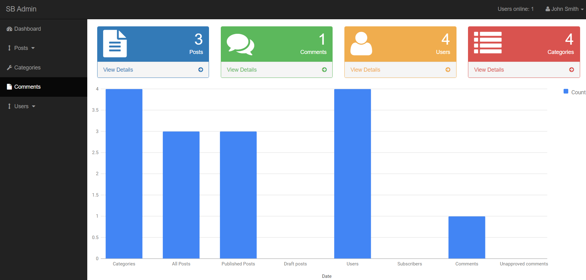

<h1 align="center">CMS (Content Manegement System) </h1>

## Sobre o projeto

Um sistema de gerenciamento de conteúdo, é utlizado para criar, editar, publicar e administrar conteúdos em plataformas digitais. Esse sistema permite a modificação, remoção e adição de conteúdo sem a necessidade de conhecimento de HTML. Trata-se de uma ferramenta que facilita a criação, armazenamento e administração dinâmica de diversos tipos de conteúdo, como textos, imagens, documentos e outros formatos de arquivos digitais, através de uma interface. 

    

### Tecnologias utilizadas:

* 
* 
* 

